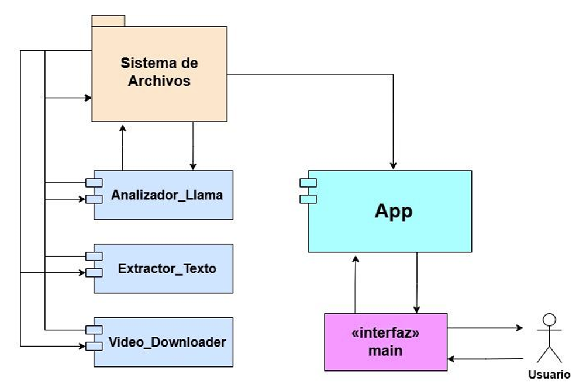
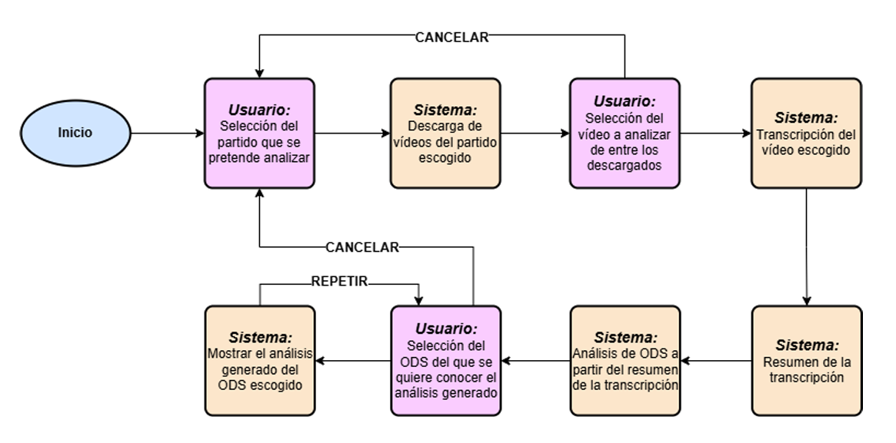
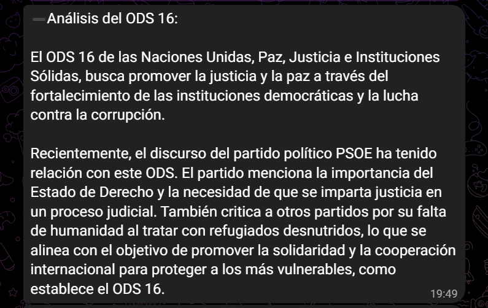

# Sistema Basado en LLMs Para Clasificación de Vídeos

## Descripción
"Sistema Basado en LLMs Para la Clasificación de Vídeos" es un programa originalmente titulado "Sistema Basado en Modelos Grandes del Lenguaje Para la Clasificación de Vídeos en ODS" correspondiente al **Trabajo de Fin de Grado** (TFG) del dueño de este repositorio. Este trabajo, correspondiente a la carrera de **Ingeniería Informática en la Universidad Carlos III de Madrid**, fue desarrollado durante el verano de 2024, entregado en septiembre y defendido el 4 de octubre obteniendo una **calificación final de un 9.5 sobre 10**.

**El sistema consiste en el uso de modelos grandes del lenguaje, en este caso LlaMa 3, para analizar los vídeos subidos a los canales de YouTube de los principales partidos políticos de España en busca de alguna referencia a alguno de los Objetivos de Desarrollo Sostenible de las Naciones Unidas.** Se trata de un sistema interactivo, en el que, a través de un bot de Telegram, cualquier usuario puede escoger el partido y vídeo que quiera analizar.

## Tabla de Contenidos
- [Motivo del Proyecto](#motivo-del-proyecto)
- [Tecnologías Utilizadas](#tecnologías-utilizadas)
- [Funcionamiento del Sistema](#funcionamiento-del-sistema)
- [Validación](#validación)
- [Resultados](#resultados)
- [Licencia](#licencia)
- [Contacto](#contacto)

## Motivo Del Proyecto
En la actualidad, según la web [Statista](https://es.statista.com/temas/10917/youtube-datos-mundiales/#topicOverview), solo en la plataforma YouTube se publican alrededor de 500 horas de vídeo cada minuto. Esto hace completamente imposible mantenerse al día de todo lo que se publica. Además, es común que los creadores de contenido alarguen sus vídeos para ganar más dinero algo que hace que los espectadores se vean afectados y la búsqueda de información en este formato se vuelva un proceso poco productivo que consume mucho tiempo. 

**Este proyecto pretende probar que es posible clasificar y analizar vídeos utilizando modelos grandes del lenguaje** para que no sea necesario ver los vídeos completos para conocer su contenido. Para ello, finalmente se sustituirán los vídeos por análisis breves de texto con la información relevante.

Si bien este problema se puede afrontar de muchas maneras posibles, el tema escogido ha sido la clasificación de vídeos políticos dentro de los diferentes ODS, siglas de [Objetivos de Desarrollo Sostenible](https://www.undp.org/es/sustainable-development-goals).

## Tecnologías Utilizadas
La infraestructura de este sistema está compuesta por 6 principales elementos:

 - **Python:** Tanto el código del sistema como el del programa de validación ha sido escrito completamente utilizando Python.

 - **YouTube:** Se trata de la plataforma escogida para la extracción de los vídeos por su gran popularidad. Para navegar por la misma se utiliza la API oficial y para la descarga de vídeos una librería de terceros llamada "[pytube](https://pytube.io/en/latest/)".

 - **Telegram:** El bot que actúa como interfaz es creado en esta plataforma.

 - **Whisper:** Modelo de inteligencia artificial desarrollado por OpenAI que se dedica a la generación de transcripciones de audio y vídeo y de traducciones. Este se usa en el sistema para generar las transcripciones de los vídeos descargados.

 - **LlaMa 3:** Modelo grande del lenguaje desarrollado por Meta AI y considerado como uno de los más versátiles y con mayor potencial que existen. La versión 3 fue lanzada en 2024 y es el modelo utilizado para realizar la clasificación de los textos dentro de los ODS.

 - **LM Studio:** Programa cuya funcionalidad es lanzar modelos del lenguaje en un servidor local para poder ser utilizados.

## Funcionamiento del Sistema
El flujo del sistema desarrollado es muy sencillo ya que el sistema lleva a cabo **3 principales operaciones** para obtener un análisis:

- **Descargar un vídeo de un partido político:** La descarga de vídeos se hace en formato de audio para reducir el gasto de tiempo y memoria. Además, solo se descargan vídeos de entre 1 y 8 minutos que hayan sido publicados los últimos 2 meses.

- **Transcribir los vídeos a texto:** Se utiliza el modelo más grande de Whisper para obtener transcripciones de los diferentes vídeos y se resumen los textos finales utilizando la librería de Python "[sumy](https://pypi.org/project/sumy/)" con el algoritmo LSA (necesario para no saturar el modelo).

- **Analizar los textos:** El prompt diseñado se utiliza en LlaMa 3 junto con el resumen de la transcripción generada para que se detecte la presencia de algún ODS en caso de existir. Para cada ODS detectado, se generará un análisis que siempre tendrá la misma estructura. Esta será de 2 párrafos, el primero con una breve introducción de en qué consiste el ODS y el segundo que indica lo que se menciona en el vídeo que tiene relación con ello.

De acuerdo a estas operaciones, se diseñó una estructura modular para el código cuya arquitectura es la siguiente:

El sistema de archivos es de gran importancia ya que es el punto que utilizan todos los módulos para leer y escribir la información necesaria para llevar a cabo todo el proceso.

Por otro lado, la interacción del usuario con el bot se produce de la siguiente manera:

## Validación
Para llevar a cabo la validación del sistema, se llevaron a cabo un conjunto de **pruebas unitarias** para las funciones independientes y **pruebas manuales** con el uso del bot. Todas ellas obtuvieron los resultados esperados.

Por otro lado, se diseñó un **programa de validación para evaluar cada prompt utilizado para la clasificación**. Este prompt es el elemento más importante del proyecto y fue desarrollado mediante un proceso experimental, perfeccionándolo tras cada prueba. El programa que lo valida funciona de la siguiente manera:

**1.** A partir de unos Excel con frases clasificadas según si aparece o no el ODS 5, estos se procesan limpiando filas duplicadas o vacías y columnas innecesarias.

**2.** Se analiza cada frase resultante utilizando el prompt que se pretende evaluar.

**3.** Se comparan los resultados obtenidos con las etiquetas originales y se generan estadísticas de aciertos.

## Resultados
El prompt que fue escogido finalmente fue evaluado con el programa de evaluación utilizando un total de **3 archivos Excel con en total alrededor de 1000 frases**. Los resultados obtenidos fueron los siguientes:

| Número del Excel | Número de frases | Porcentaje de aciertos |
|-----------------|------------------|-------------------------|
| Excel 1         | 356              | **93.54%**                  |
| Excel 2         | 327              | **88.38%**                 |
| Excel 3         | 391              | **91.82%**                |

Estos resultados demuestran la gran precisión y fiabilidad de este sistema, algo que se vio reflejado en las pruebas manuales con vídeos reales. A continuación, se adjunta una captura de **ejemplo de uno de los análisis generados por LlaMa**:

## Licencia
Este proyecto está licenciado bajo la **Licencia Pública de Mozilla (MPL) 2.0**. Esto significa que eres libre de usar, modificar y distribuir el software, pero cualquier archivo modificado que distribuyas debe conservar la misma licencia MPL. También debes incluir la licencia original y el aviso de derechos de autor en cualquier copia del software o archivos modificados que distribuyas.

## Contacto
En caso de que sea necesario, contactar con el dueño de este repositorio.
